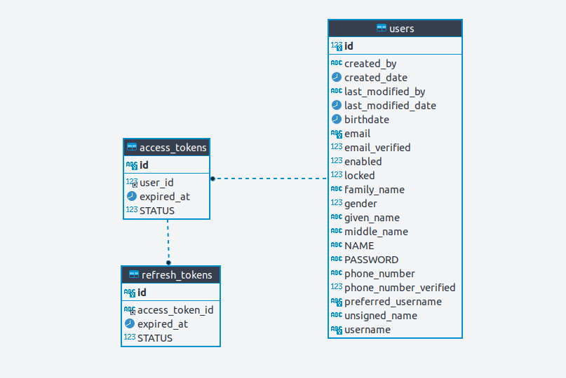
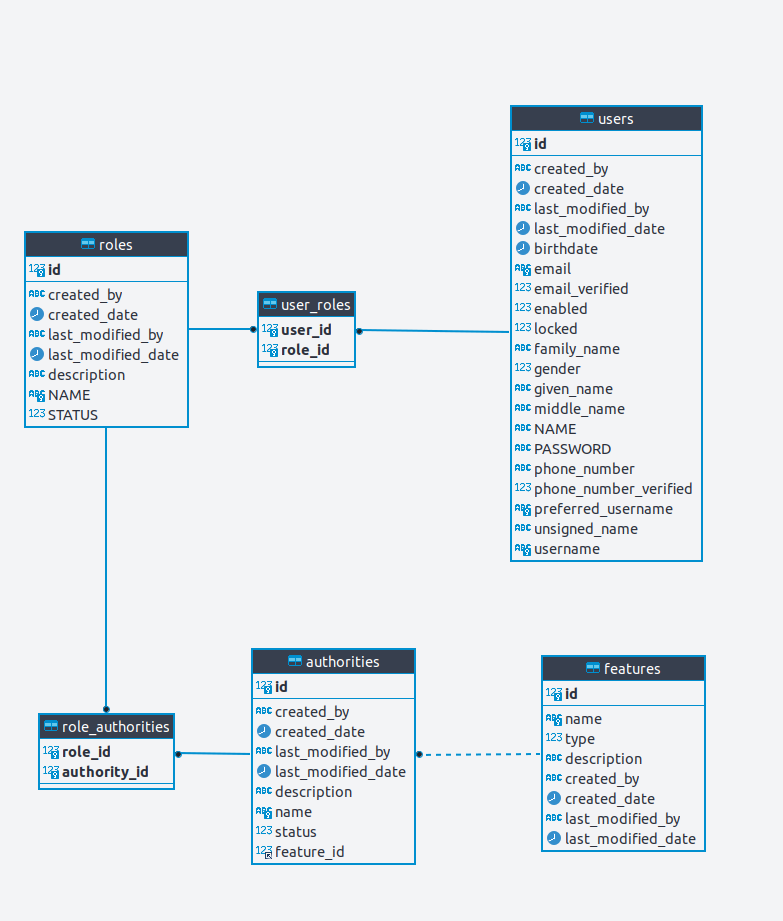

# Let's get started

As a java developer, I spent most of my time working with Spring Boot - a powered framework. Spring Boot also has many
configurations that make you confused, through. I started to create a boilerplate framework for a monolithic app to handle
some aspects to get business faster.

Some aspects of this project

- [x] Handle Authentication flow with self JWT and Oauth2 resource server.
- [x] Handle Role -> Privilege Strategy
- [x] Refined ReST response with understood JSON structure.
- [ ] Metrics integration

## Structure

#### COMMON MODULE - settings, configurations for project

> **annotation** package

- **api**: Combination annotation of Spring Boot and Springdocs (OpenAPI) for short. For example
    - ***@RestHandler*** ***=*** *@RestController* *@RequestMapping* of SpringBoot ***+*** *@Documented*
      *@Tag(name = "")* of SpringDocs
- **context**: Cause I separated the project to smaller modules ( actually we have more than 6 modules in our private
  business). This is a place to store some interfaces to get private resource definitions like (MessageSource, Caching,
  etc...). For example: You can see ***MessageResourceClaim*** interface, each module must define their own
  MessageResource, then when the app started, message resources will be initiated in all modules.

        // Declare 
        @Modular  
        @PropertySource({"classpath:common00.properties"})  
        public class CommonModular implements MessageResourceClaim {  
           @Override  
          public String[] messageSource() {  
              return new String[] {"classpath:common-messages"};  
           }  
        }
  	
        // Initial
        @Configuration  
        @RequiredArgsConstructor  
        class MessageSourceConfigurer {  
      
           private final List<MessageResourceClaim> instructors;  
        
           @Bean  
           @Primary @Order(Ordered.HIGHEST_PRECEDENCE)  
           public MessageSource messageSource() {  
              var sourcePaths = StreamEx.of(instructors)  
                    .map(MessageResourceClaim::messageSource)  
                    .flatMap(Arrays::stream)  
                    .toArray(String.class);  
        
            var messageSource = new ReloadableResourceBundleMessageSource();  
            messageSource.setBasenames(sourcePaths);  
            messageSource.setDefaultEncoding(StandardCharsets.UTF_8.name());  
            return messageSource;  
           }  
        }

> **configurer** package

- ***AuthenticationProviderConfigurer***: Initial *PasswordEncoder* and *UserDetailsService* for self JWT authentication
  flow
- ***BootstrapAppConfigurer***: Initial default ADMIN user and role (ADMIN, MEMBER)
- ***DatabaseAccessConfigurer***: Initial Spring data configuration for (Jdbc and MongoDB) - Can be changed to JPA (but
  I hated JPA)
- ***DefaultWebSecurityConfigurer***: Configure web security for cors, jwt, oauth2 resource server

> **entity** package

- Project is built for MariaDB (**rdb** package) and MongoDB (**mongodb** package)

> **message** package

- **Translator**.eval() help you solve message in multiple languages

> **response** package

- Contain Response template builder for error and success, response always container **status**, **metadata**, **payload**

        // Error response sample
        {
            "status": 401,
            "metadata": {
                    "timestamp": "2022-08-23T17:27:21.318259+07:00",
                    "traceId": "a600e902126de187",
                    "reportId": "NTA5NzJlY2YtNWQxMC00MGJmLTk5ZTEtYWJmZjAwMzMyODI5"
            },
            "payload": {
                    "message": "Authentication failed",
                    "details": "Token is invalid"
            }
        }

#### CORE MODULE - implement your business

> Implementation of business logic

## PROJECT MODEL

## [Take a look on Spring Security](https://docs.spring.io/spring-security/reference/servlet/architecture.html)

## Authentication With JWT

**Generate Token**
```mermaid {code_block=true}
sequenceDiagram
    autonumber
    actor Client
    participant App
    participant Database
    Client->>+App: Sent login data
    Note left of Client: username: username or email<br/>password: is presented<br/>rememberMe: true or false
    App->>App: Run spring authentication flow
    alt wrong user/password
      App-->>Client: Sent error response
    else valid user/password
      App->>App: generate AccessToken, RefreshToken
      App->>-Database: save AccessToken and RefreshToken
    end
    App-->>Client: Send JWT token
```
**Using Token To Access Resource**
```mermaid {code_block=true}
sequenceDiagram
    autonumber
    actor Client
    participant App
    participant Database
    Client->>+App: Access to resoure /userinfo
    Note left of App: Send JWT Token<br/>(Bearer Type)
    opt JWT Authentication Filter
      App->>App: Check if token is self<br/> issued by server
      alt self issued
        App-->>Database: Check if JWT Token existed
        Database->>App: Send back AccessToken Entity
        alt token is inactive
          App-->>Client: Send error response
        else token still active
          App-->>Database: Get current User data
          Database->>App: Send User Entity
          App->>App: Build UserDetails
          Note right of App: User data and<br/> authorities
          App->>App: Check UserDetails status
          alt UserDetails in valid
            App-->>Client: Send error response
          else UserDetails valid
            App->>App: Call Controller /userinfo<br/>to get data
            App-->>Client: Send data 
          end
        end
      else issued 3rd Outh2Server
        App->>App: Next<br/> Oauth2 Authentication Filter
      end
    end
```
### Implementation
- Create [**JwtTokenAuthenticationFilter**](common/src/main/java/io/github/tuyendev/mbs/common/security/jwt/JwtTokenAuthenticationFilter.java) and register with [**SecurityFilterChain**](common/src/main/java/io/github/tuyendev/mbs/common/configurer/DefaultWebSecurityConfigurer.java#L67)

        @EnableWebSecurity
        @EnableGlobalMethodSecurity(prePostEnabled = true, securedEnabled = true, jsr250Enabled = true)
        class DefaultWebSecurityConfigurer {
            ...

            @Bean
            public SecurityFilterChain filterChain(HttpSecurity http) throws Exception {
                // @formatter:off
                ...
                http.formLogin().disable()
                        .logout().disable()
                        .httpBasic().disable()
                (***)   .apply(securityConfigurerAdapter());
                ...
                http.exceptionHandling()
                        .authenticationEntryPoint(new DefaultAuthenticationEntryPoint(resolver));
                return http.build();
                // @formatter:on
            }

            private JwtSecurityAdapter (***)securityConfigurerAdapter()  {
                return new ($$$)JwtSecurityAdapter(tokenProvider, new DefaultAuthenticationEntryPoint(resolver));
            }
        }

        public class ($$$)JwtSecurityAdapter extends SecurityConfigurerAdapter<DefaultSecurityFilterChain, HttpSecurity> {   
            ....
            @Override
            public void configure(HttpSecurity http) {
                http.addFilterBefore(new (@@@)JwtTokenAuthenticationFilter(tokenProvider, authenticationEntryPoint), UsernamePasswordAuthenticationFilter.class);
            }
        }

        public class (@@@)JwtTokenAuthenticationFilter extends GenericFilterBean {

            ...

            @Override
            public void doFilter(ServletRequest request, ServletResponse response, FilterChain chain) throws IOException, ServletException {
                doFilterInternal(request, response, chain);
            }

            private void doFilterInternal(ServletRequest request, ServletResponse response, FilterChain chain) throws ServletException, IOException {
                HttpServletRequest httpServletRequest = (HttpServletRequest) request;
                String jwt = resolveToken(httpServletRequest);
                if (StringUtils.hasText(jwt) && tokenProvider.isSelfIssuer(jwt)) {
                    try {
                        this.tokenProvider.authorizeToken(jwt);
                        chain.doFilter(new HiddenTokenRequestWrapper((HttpServletRequest) request), response);
                    }
                    catch (AuthenticationException e) {
                        SecurityContextHolder.clearContext();
                        this.logger.trace("Failed to process authentication request", e);
                        this.authenticationEntryPoint.commence((HttpServletRequest) request, (HttpServletResponse) response, e);
                    }
                }
                else {
                    chain.doFilter(request, response);
                }
            }

            private String resolveToken(HttpServletRequest request) {
                String bearerToken = request.getHeader(AUTHORIZATION_HEADER);
                if (StringUtils.hasText(bearerToken) && bearerToken.startsWith(BEARER_TOKEN_PREFIX)) {
                    return bearerToken.substring(7);
                }
                return null;
            }
            ...
        }

> Note: Cause JWT Filter and Oauth2 Filter both consume Bearer Token, if a token is valid with JWT Filter flow, the Bearer Token will be removed (hidden) before run next filter
> .That why we create [HiddenTokenRequestWrapper](common/src/main/java/io/github/tuyendev/mbs/common/security/jwt/JwtTokenAuthenticationFilter.java#L72) to hide token data

        chain.doFilter(new HiddenTokenRequestWrapper((HttpServletRequest) request), response);
## Authentication as  Oauth2 resource server
```mermaid {code_block=true}
sequenceDiagram
    autonumber
    actor Client
    participant App
    participant Database
    Client->>+App: Access to resoure /userinfo
    Note left of App: Send JWT Token<br/>(Bearer Type)
    alt JWT Authentication Filter
      App->>App: Run JWT Authentication Filter
      App-->>Client: Send response
    else Oauth2 Authentication Filter
      App-->>App: Check if token is valid
      alt Token is invalid
        Note right of App: Token wrong format<br>expired, etc.
        App-->>Client: Send error response
      else Token is valid
        opt Convert Oauth2 Token
          App-->>App: Extract emal from Token
          App->>Database: Find user<br/> by email
          Database-->>App: Send User Entity
          App->>Database: Create or Update user
          App->>App: Convert Oauth2 JWT to UserDetails
          opt Check UserDetails status
            alt invalid
              App-->>Client: Send error response
            else valid
              App->>App:Call Controller /userinfo<br/>to get data
              App-->>Client: Send data
            end
          end
        end 
      end
    end
```
### Implementation
Add Oauth2 Server Config

      spring.security.oauth2.resourceserver.jwt.issuer-uri=http://localhost:8882/realms/monolithic
      spring.security.oauth2.resourceserver.jwt.jwk-set-uri=http://localhost:8882/realms/monolithic/protocol/openid-connect/certs

Register [Oauth2JwtAuthenticationConverter](common/src/main/java/io/github/tuyendev/mbs/common/security/oauth2/DefaultOauth2JwtAuthenticationConverter.java) and update configuration in  [**SecurityFilterChain**](common/src/main/java/io/github/tuyendev/mbs/common/configurer/DefaultWebSecurityConfigurer.java#L68)

        @Bean
        public SecurityFilterChain filterChain(HttpSecurity http) throws Exception {
            // @formatter:off
            ...
            http.oauth2ResourceServer(oauth2 ->
                                oauth2.jwt(jwtConfigurer -> jwtConfigurer.jwtAuthenticationConverter(oauth2JwtAuthenticationConverter)));
            ...
            return http.build();
            // @formatter:on
        }

## Role Strategy
### Explanation

- Each **Module** treated as **Feature** table in database. Feature/Module has each own pre-defined
  privileges/authorities can be
  configurable by implement
  interface [FeaturePrivilegeClaim](common/src/main/java/io/github/tuyendev/mbs/common/annotation/context/FeaturePrivilegeClaim.java)

  		public interface FeaturePrivilegeClaim {  
  		  
  		  /**  
  		  * Not changeable field, change name will cause problems to running app * @return  
  		  */  
  		  String getName();  
  		  
  		  /**  
          * A changeable field, can be updated to re-initial 
          * @return  
  		  */  
  		  String getDescription();  
  		  
  		  /**  
  		  * A changeable field, can be updated to re-initial
  		  * Privileges presented by a map that contain (name as key, description as value)
  		  * The name of each Privilege should be unique in the whole system.
          * @return
  		  */  
  		  Map<String, String> getPrivileges();  
  		}

Example: Feature **SALE** included *READ_REPORT, CREATE_REPORT, READ_CONTRACT, CREATE_CONTRACT, DELETE_CONTRACT,
APPROVE_CONTRACT*

- Role is groups of Authority. For example, we can have **SALE_VIEWER_ROLE** with authorities *READ_REPORT &
  READ_CONTRACT* or **SALE_MAKER_ROLE** included *READ_REPORT, CREATE_CONTRACT, DELETE_CONTRACT*.
- Each *User* can define mutiple *Role*-s. When a user do login, or access by token, all associate authorities will be
  added automatically.

- In java code, the developer can simple use @PreAuthorize or @PostAuthorize to handle access

      @GetRequest  
      @PreAuthorize("hasAuthority('READ_CONTRACT')")  
      public Response<String> doSomething() {  
         return Response.ok();  
      }

### Implementation
- Implement **FeaturePrivilegeClaim** interface

  		@Modular  
  		@PropertySource({"classpath:common00.properties"})  
  		public class CommonModular implements MessageResourceClaim, FeaturePrivilegeClaim {  
  		   @Override  
  		  public String[] messageSource() {  
  		      return new String[] {"classpath:common-messages"};  
  		   }  
  		  
  		   @Override  
  		  public String getName() {  
  		      return "COMMON";  
  		   }  
  		  
  		   @Override  
  		  public String getDescription() {  
  		      return "Access to common resource";  
  		   }  
  		  
  		   @Override  
  		  public Map<String, String> getPrivileges() {  
  		      return Map.of("COMMON_READ", "app.common.message.privilege.read");  
  		   }  
  		}

- Initial setup at application
  boot [Sample code](common/src/main/java/io/github/tuyendev/mbs/common/configurer/BootstrapAppConfigurer.java#L140)
- See the [mockup](../docs/role-strategy.pdf)
